# StarCraft II Layouts

Visual Studio Code extension introducing extensive support for **SC2Layout** language, utilized in games like StarCraft II and Heroes of the Storm.

> Schema files of `SC2Layout` are hosted in its own [repository](https://github.com/SC2Mapster/sc2layout-schema), from which this extension will always pull most recent version.

* [Contributing](CONTRIBUTING.md)

## Features

It provides all basic stuff you'd expect from extension of this sort. However, it also includes some more obscure things - this section will briefly mention these.

---

### Custom abbreviations

Quick and convenient way for inserting code snippets.

They function the same way as normal code completions, with one exception - they're supposed to be triggered directly inside content of XML element. Upon accepting they'll be expanded to include all boilerplate code.

#### Frame declarations

Syntax: __`:`__*`FrameType`*

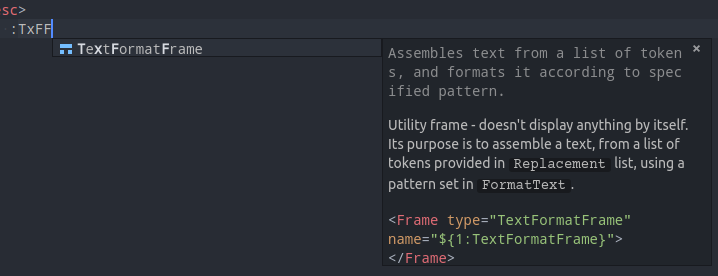

#### Desc overrides

Syntax: __`/`__*`Filename/Path/ToTheFrame/Image`*

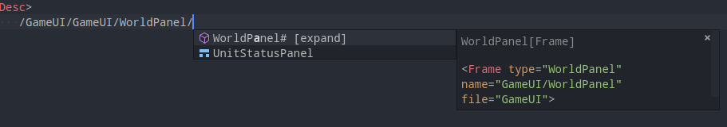

 * Works with Frames, Animations, Stategroups.
 * Special `#` character at the end is utilized to accept suggestion and expand to choosed element.
 * Suggestions list can be triggered only within root element (`<Desc>`).

#### Desc extending / overloading

Syntax: __`.`__*`Name`*

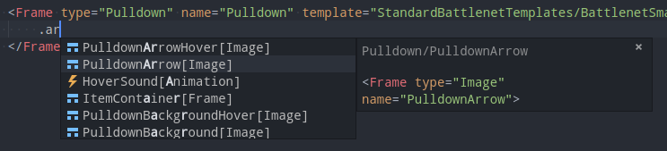

 * Listing elements elements from template/templates used within the scope.
 * Listing elements elements from foreign desc - when overriding frame declared in another layout etc.
 * Listing native hookups available for implementation.
 * Works with deeply nested elements.
 * Suggestions list will exclude elements that are already extended/implemented in scope of current declaration.

---

### Custom panels

Accessible from the activity bar on the left - it will open in a separate container.

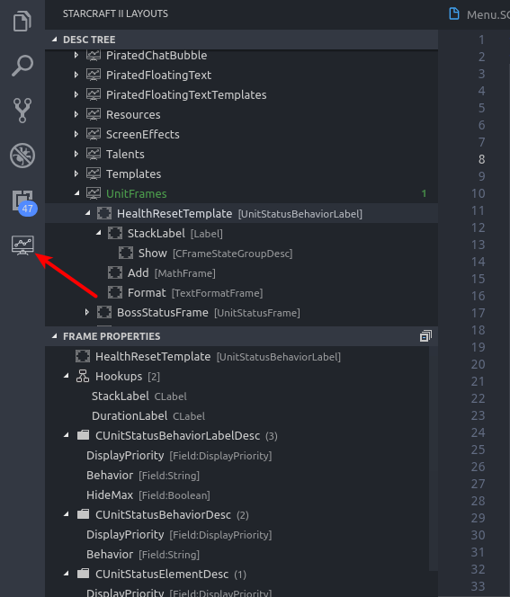

#### Desc tree

All layout files from the workspace and their content arranged in a tree.

#### Frame properties

Provides basic informations about selected frame in corresponding DescTree panel. It includes:

 * Native hookup list
 * Desc types of a frame and its fields
 * Class types of a frame and its properties

---

### Other stuff

Random screenshots made during development. Some of the things shown here are probably bit out of date - it has been improved since then.

#### Code completions

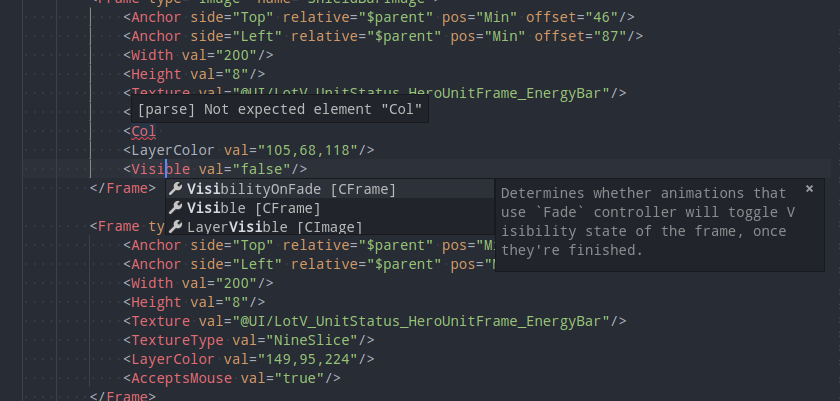

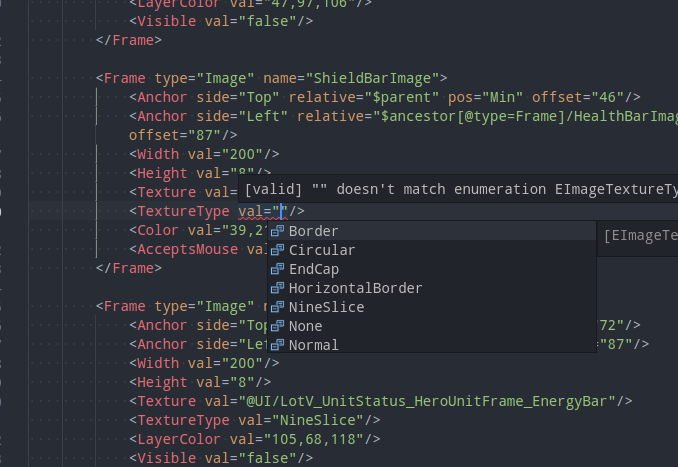

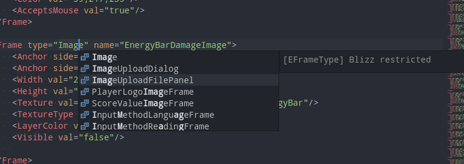

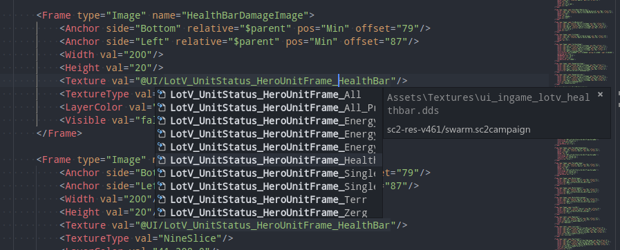

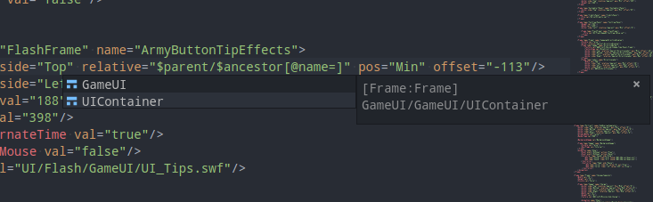

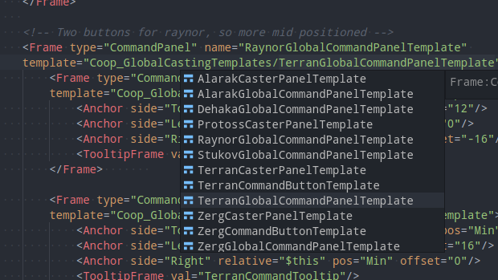

#### Goto definition

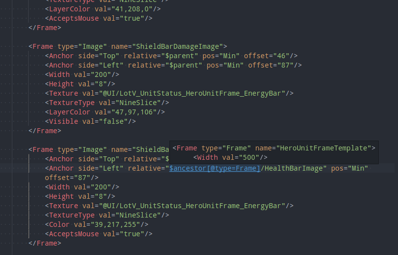

#### Document and workspace navigation

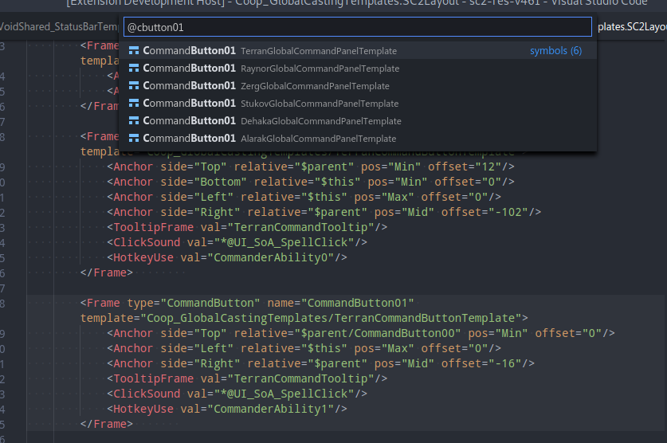

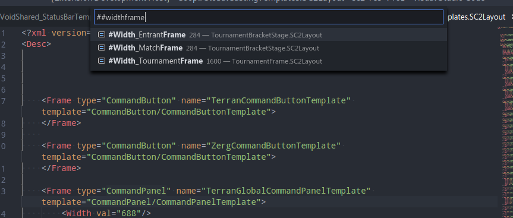

#### Code diagnostics

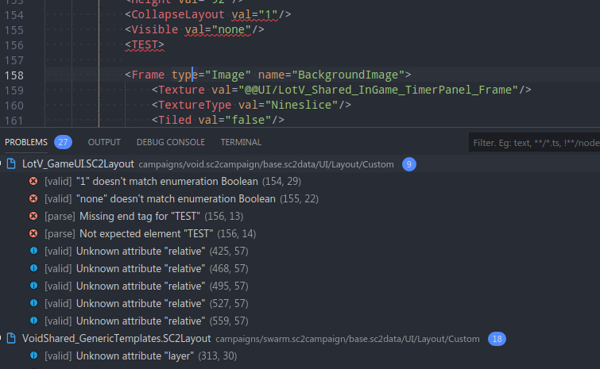
